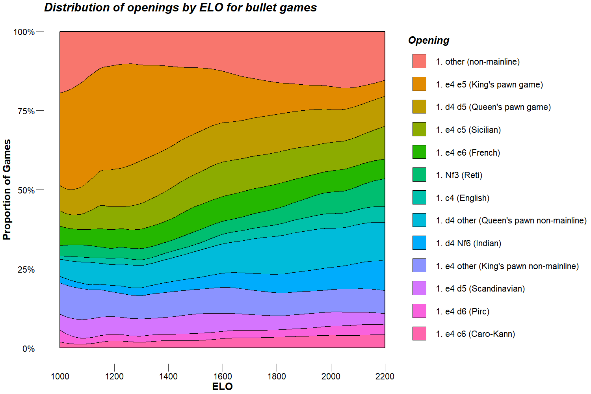

# Openings played on lichess.org
Visualizing how chess openings differ by ELO and time control

### The data  

The dataset consists of bullet, blitz, and classical games played on lichess.org during February 2016. Only games with more than 0 moves and an average ELO between the players of 1000-2200 are considered. The dataset comes from the [lichess.org game database](https://database.lichess.org). The original dataset contains 5,015,361 games. The cleaned dataset that we consider contains 4,997,502 games. This dataset is somewhat old, but the huge amount of games *(75,628,855 in May 2020!)* prevents me from using data from recent months unless I sample. I want to try this on new data at some point, but I don't currently have the hardware to do so.  

### How are time controls determined?  
From lichess.org:  
> Lichess time controls are based on estimated game duration = (clock initial time) + 40 × (clock increment)  
> For instance, the estimated duration of a 5+3 game is 5 × 60 + 40 × 3 = 420 seconds.  

Cutoffs:  
≤ 180s = Bullet  
≤ 480s = Blitz  
\> 480 = Classical  

You: *Where are Rapid and Ultrabullet? Did you omit them?*  

Me: *The data comes from a time before [Rapid](https://lichess.org/blog/Wh9KWiQAAI5JrKVn/introducing-rapid-ratings) and [Ultrabullet](https://lichess.org/blog/WN7V-jAAAAdH8ITR/announcing-instant-chess) were introduced. Games in the data with time controls that would be considered Rapid and Ultrabullet today fall under the Classical and Bullet time controls respectively.*  

### A note on ELO ranges  
The range of 1000-2200 ELO was chosen because beyond these two endpoints the games become sparse and the opening distributions have extreme variance. The rating distributions between the three time controls are not exactly the same, but a common range is needed in order to compare them. A better metric to compare time controls may be a comparative rating based on ELO percentile instead of absolute ELO rating. This would be a reasonable thing to try and slightly harder, so I encourage you to fork this project and give it a go! 
